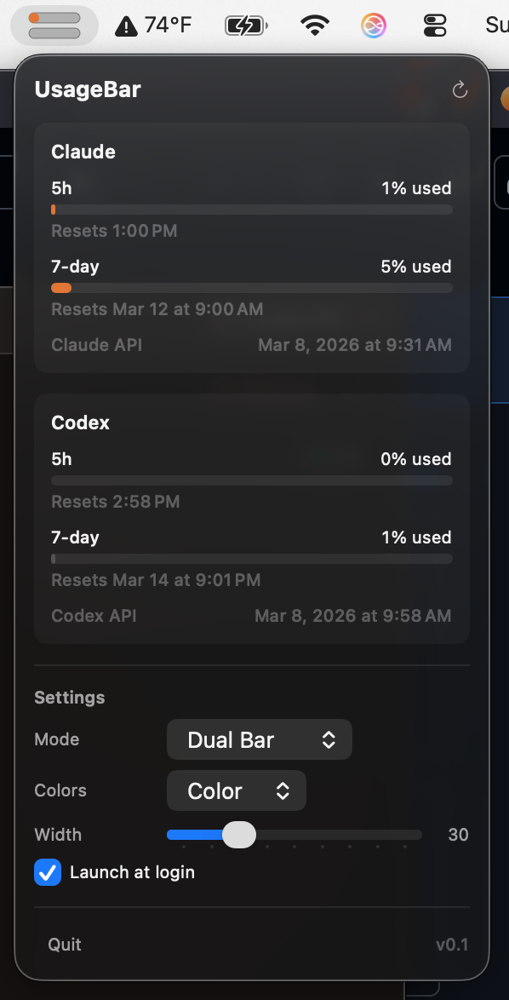

# UsageBar

A tiny macOS menu bar app that shows your Claude and Codex API quota usage at a glance.

I got tired of getting rate limited and not knowing how close I was to the limit, so I made this. It reads your existing auth tokens and polls the usage APIs every few minutes.

## Features

- Shows quota usage as small colored bars right in your menu bar
- Supports both Claude and Codex (or just one)
- Click to see a dashboard with detailed usage, reset times, and extra credits
- Color or monochrome mode
- Launch at login
- No external dependencies — just Swift and SwiftUI

## Install

```bash
./build-app.sh
cp -r UsageBar.app /Applications/
```

Requires macOS 14+ and Swift 6.2.

## Setup

UsageBar reads credentials automatically:

- **Claude** — uses your existing `~/.claude/.credentials.json` (from Claude Code)
- **Codex** — uses `~/.codex/auth.json`

Just log in to those tools normally and UsageBar picks up the tokens.

## Screenshots



